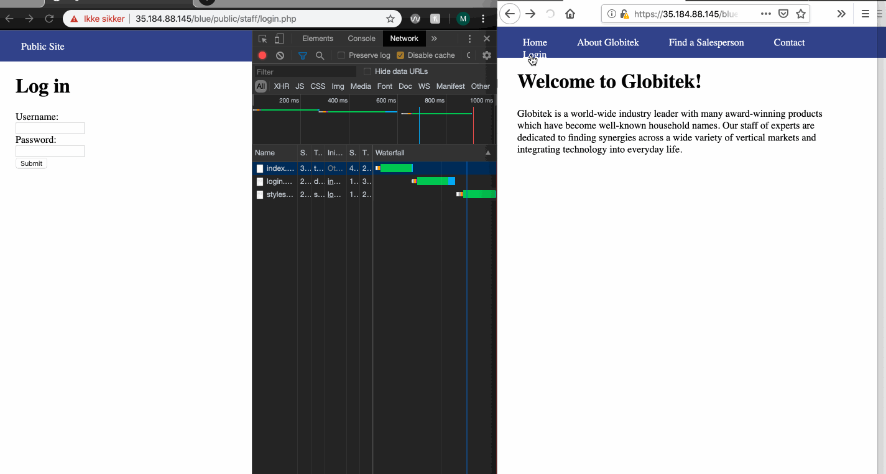
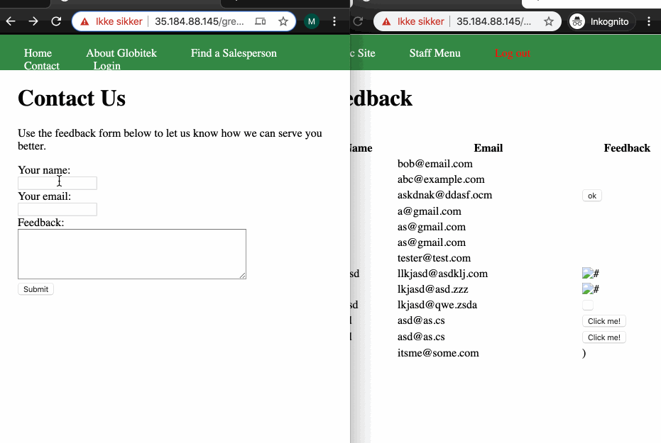
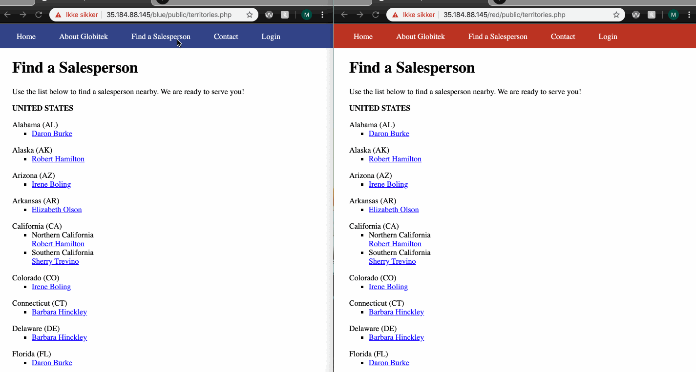
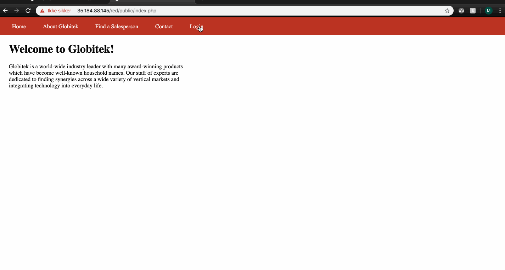

# Project 9 - Pentesting Live Targets

Time spent: **X** hours spent in total

> Objective: Identify vulnerabilities in three different versions of the Globitek website: blue, green, and red.

The six possible exploits are:
* Username Enumeration
* Insecure Direct Object Reference (IDOR)
* SQL Injection (SQLi)
* Cross-Site Scripting (XSS)
* Cross-Site Request Forgery (CSRF)
* Session Hijacking/Fixation

Each version of the site has been given two of the six vulnerabilities. (In other words, all six of the exploits should be assignable to one of the sites.)

## Blue

Vulnerability #1: Session Hijacking
- Where /staff/login.php
#### How:
1. Login with valid username and password
2. Access the session id
3. Update session id in another browser with the logged in session id
4. Try to login

For the blue page the user agent string does not trigger a new session id, thus makes it possible to login with a valid logged in session id from another browser/user which is updated through the session updating tool.

Vulnerability #2: __________________

## Green

Vulnerability #1: User Enumeration
- Where: /staff/login.php
- Reveal: A valid Username
#### How:
1. Go to login page
2. Try a random username and look at the response text that gives an error message
3. Try a known username *pperson*
4. Look at the difference in how the error message is displayed

On green page, we will see that the error message is displayed in bold text when a known acceptable username is entered.

Vulnerability #2: XSS
- Where: /public/contact.php
#### How:
1. Go to contact/feedback page
2. Fill out form with name and email
3. Insert html/script tag with an event listener which triggers an alert

As a staff member on green page that wants to read through feedback is vulnerable to XSS attacks. The text area does not handle cross site scripts, which means that any scripts provided in the feedback can be run on the staff side of the website.

## Red

Vulnerability #1: Insecure Direct Object Reference (IDOR)
- Where: /public/territories.php
- Reveal: Authenticated information
1. Go to Find a Salesperson
2. Click on the first salesperson on the site.
3. Look at the id of that specific person
4. Try different id's to see what information/persons you are getting.

Both green and blue page redirects any unauthenticated user back to /territories.php if an ID provided is not public. On the red page however, the information stored for this specific id is shown to anyone that provide the id in the url.

Vulnerability #2: Cross-Site Request Forgery
#### How:
1. Hacker creates a form with updated/malicious information
2. This form has to be a request to an internal endpoint
3. Hacker provides a link or any other triggers that makes sure a logged in user executes the hacker's form
4. Logged in user executes the form provided as a link/xss or something similar.

For the red page I found out that the CSRF token is not needed in order to update a user, salesperson or countries/states. This makes it vulnerable for CSRF attacks. I created a html page, hosted on heroku which has a hidden form that sends information to the desired endpoint upon page load. In order for this to succeed, a logged in user has to enter this site. To achieve this part I (as the hacker) provided feedback in the feedback page with a link to my page. The link is also *camouflaged* with bitly to make it less suspicious. Upon click from a logged in user, the information for Ken is updated to what the hacker wants.

## Notes

Describe any challenges encountered while doing the work
